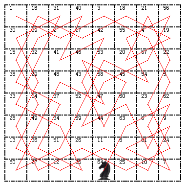
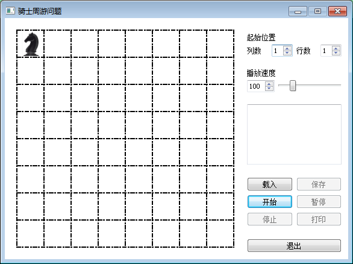
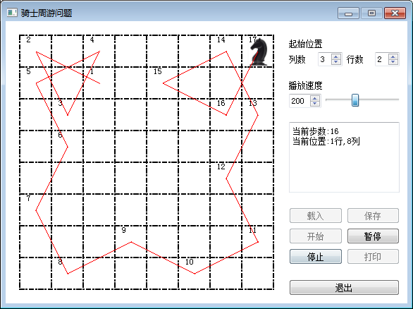
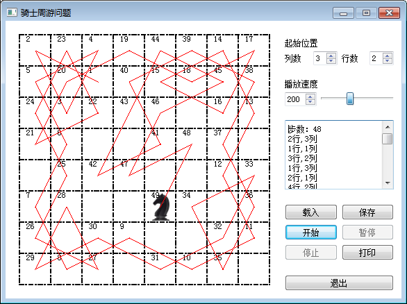
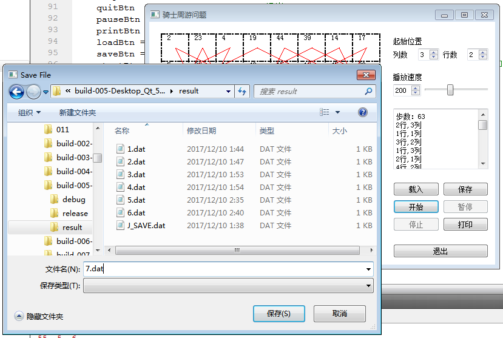
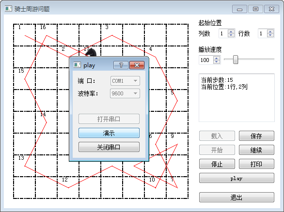
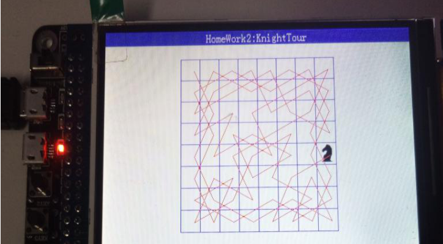

# 骑士周游问题
考虑国际象棋棋盘上某个位置的一只“马”，它是否可能只走63步，正好走过除起点外的其他63个位置各一次？如果有一种这样的走法，则称所走的这条路线为一条马的周游路线。  
国际象棋的棋盘为8*8的方格棋盘，现将“马”放在任意指定的方格中，按照“马”走棋的规则将“马”进行移动。要求每个方格只能进入一次，最终使得“马”走遍棋盘64个方格。  

## 要求  
* 完整的图形用户界面，可设置棋盘初始位置、动画速度等参数；
* 算法支持多线程；
* 执行过程可以暂停/继续；
* 算法执行的结果（包括中间结果）可以持久化（以自定义数据格式保存到文件中）；
* 可从文件中读取数据，并在此基础上继续执行；
* 实时图形化显示执行结果；
* 可在执行完成后，或暂停时，打印执行的当前结果。

## 算法选择
搜索算法是利用计算机的高性能来有目的的穷举一个问题的部分或所有的可能情况，从而求出问题的解的一种方法。搜索过程实际上是根据初始条件和扩展规则构造一棵解答树并寻找符合目标状态的节点的过程。  
针对本问题，选用无回溯操作采的广度优先搜索算法，即使用入队和出栈的操作，牺牲内存空间来提升速度。  
队列是特殊的线性表之一，它只允许在队的一端插入，在队的另一端删除。插入一端叫队尾（T），删除一端叫队首（H），没有任何元素的队叫做空队。队列遵循"先进先出"原则，排队购物、买票等，就是最常见的队。  
广度优先搜索算法速度快但内存占用多，因此程序设计中，必须考虑溢出和节省内存空间得问题。  

## 方案设计
* 关键事件类KenEvent
* 在KenEvent类的构造函数中，完成界面背景和按键界面的绘制，初始化各个参数防止调用空指针  
* 每次QPainter *painter = new QPainter，都会引发绘图函数drawPix()，在该功能中，主要完成马跳路径的绘制，并显示路径上相应数字  
* 在各个按键的响应函数中，完成相应的功能
* 马类Horse的设计
* 设计保存和载入功能，保存时，只需记录马跳的步数和响应坐标参数即可，主要参数包括:
  1.马跳的步数 volatile int h_step  
  2.棋盘坐标 int map[MAXN][MAXN]  
  3.每一步位置 volatile int record[64][2]  
* 载入时，恢复相应的数据，重新进行一次覆盖，即可恢复到保存前的状态，可以继续执行
* 系统UI与算法的多线程通过以下方式实现，先执行完算法保存结果在map和record中，再进行图形绘制，在while循环中便于增加信号量锁并保存中间结果
* CDialog类中实现初始化串口，并发送马的路径信息给下位机，串口应用了QSerialPort类，未避免繁琐的工作，串口只提供端口和波特率的选项，其他参数如校验位等在程序中默认写死

## 运行截图

